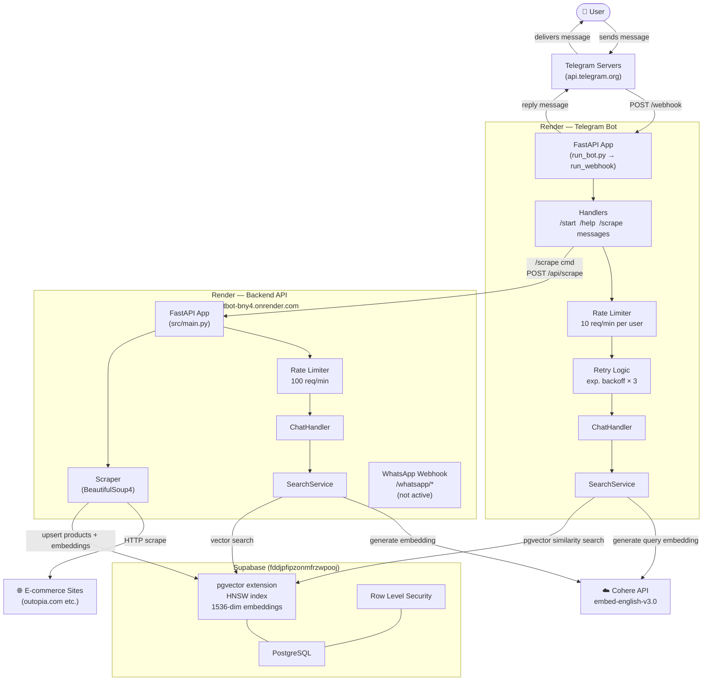

# OpenClaw Architecture



## Services

| Service | URL | Runtime | Purpose |
|---------|-----|---------|---------|
| Telegram Bot | `telegram-bot-5340.onrender.com` | Render Web Service | Webhook receiver + search logic |
| Backend API | `chatbot-bny4.onrender.com` | Render Web Service | REST API + scraper |
| Database | `fddjpfipzonmfrzwpooj.supabase.co` | Supabase | pgvector product search |
| Embeddings | Cohere API | External | `embed-english-v3.0` |

## Request Flow — User Search

```
User msg → Telegram → POST /webhook (telegram-bot-5340)
  → RateLimit check (10/min)
  → ChatHandler → SearchService
      → parse NLP filters (price/category/gender via regex)
      → Cohere: generate 1536-dim query embedding
      → Supabase pgvector: cosine similarity search
  → format results (Markdown)
→ Telegram → User
```

## Request Flow — /scrape Command

```
/scrape <url> → telegram-bot-5340
  → POST chatbot-bny4.onrender.com/api/scrape
      → BeautifulSoup scrape target URL
      → generate embeddings per product (Cohere)
      → upsert into Supabase products table
  → reply "N products scraped"
```

## Notes

- Telegram bot runs in **webhook mode** (not polling) on Render
- Both services share same Supabase DB + Cohere key (independent connections)
- WhatsApp support coded but **not deployed/active** (placeholder keys in .env)
- OpenAI key is placeholder — only Cohere used for embeddings
